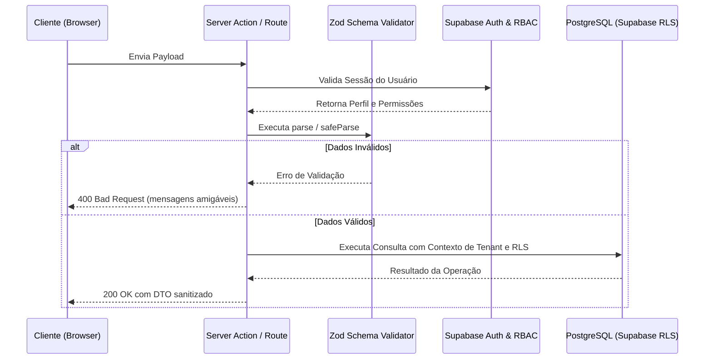

# Arquitetura de API e Server Actions - JR SAÚDE 1.0

## 1. Padrões de Comunicação
O JR SAÚDE adota **Next.js Server Actions** como padrão principal de mutação de dados para formulários e operações atômicas, complementado por **Route Handlers (`/app/api/...`)** para webhooks externos (Supabase Auth, WhatsApp Business Cloud API, Gateway de Pagamento).

---

## 2. Padrão de Resposta de API e Tratamento de Erros
Para prevenir vazamento acidental de dados sensíveis ou stack traces em produção, todos os endpoints e Server Actions retornam uma estrutura padronizada:

```typescript
export type ActionResult<T = unknown> = {
  success: boolean;
  data?: T;
  error?: {
    code: string;
    message: string;
    details?: Record<string, string[]>;
  };
};
```

---

## 3. Fluxo de Execução com Zod e RBAC



---

## 4. Endpoints Futuros Planejados
- `/api/auth/callback`: Redirecionamento e troca de código de sessão Supabase.
- `/api/webhooks/whatsapp`: Recepção segura de status de mensagens e mensagens recebidas.
- `/api/webhooks/payments`: Confirmação assíncrona de pagamentos PIX/Cartão.
