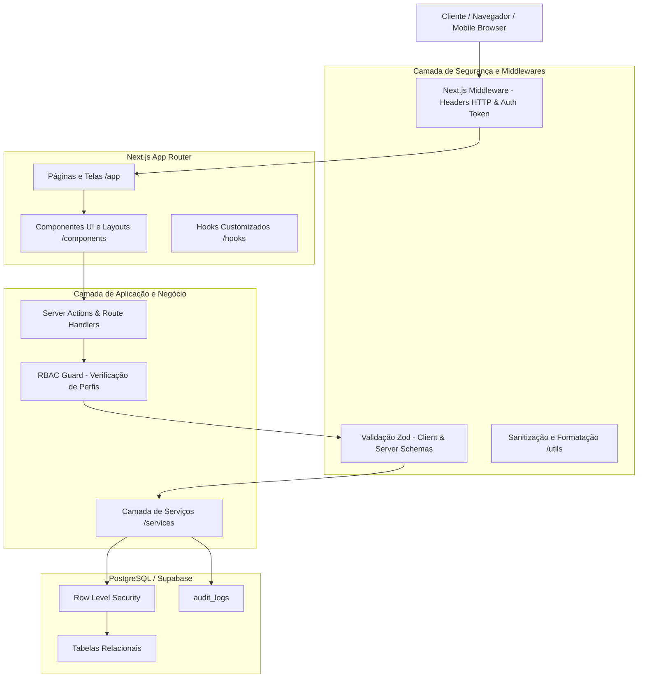

# Arquitetura do Sistema - JR SAÚDE 1.0

## 1. Visão Geral
O **JR SAÚDE 1.0** é um sistema corporativo de gestão clínica e multidisciplinar desenvolvido para a JR Saúde, com foco prioritário em fisioterapia, reabilitação, consultas multiprofissionais e o programa de fidelidade **JR Saúde Club**.

A arquitetura foi projetada para:
1. **Uso Inicial Monolítico Modular**: Operação centralizada na JR Saúde com baixíssimo overhead.
2. **Multiunidade Nativo**: Cada registro operacional referencia `tenant_id`, `clinic_id` e `unit_id`.
3. **Evolução para SaaS Multi-tenant**: Isolamento lógico de dados preparado para atender outras clínicas no futuro sem reescrita de código.
4. **Conformidade com LGPD e Prontuário Eletrônico**: Sigilo médico, rastreabilidade e trilha de auditoria completa.

---

## 2. Diagrama da Arquitetura em Camadas



---

## 3. Estrutura de Diretórios
```text
jr-saude/
├── app/                  # Rotas e páginas (App Router)
├── components/           # Componentes de interface (UI, Layout, Modais)
├── lib/                  # Clientes externos, Supabase e utilitários centrais
├── services/             # Regras de negócio desacopladas
├── types/                # Definições TypeScript estritas
├── hooks/                # Hooks React customizados
├── utils/                # Formatadores e validadores (CPF, Datas, Moedas)
├── database/             # Migrações SQL e seeds
│   ├── migrations/       # DDL do PostgreSQL com RLS
│   ├── seeds/            # Dados para desenvolvimento e homologação
│   └── sql/              # Queries de verificação e rotinas
├── public/               # Assets estáticos
├── docs/                 # Documentação técnica e manuais de governança
├── tests/                # Testes automatizados
├── scripts/              # Scripts de suporte e tarefas CI/CD
├── .env.example          # Modelo de configuração de ambiente
├── package.json          # Dependências e scripts npm
├── tsconfig.json         # Configuração estrita do compilador TypeScript
└── .gitignore            # Bloqueio de arquivos sensíveis e segredos
```

---

## 4. Princípios de Engenharia
- **Validação Dupla**: Dados são validados no frontend para UX imediata e revalidados no backend com Zod antes de qualquer persistência.
- **Zero Segredos no Cliente**: Apenas variáveis com prefixo `NEXT_PUBLIC_` são expostas; a `SUPABASE_SERVICE_ROLE_KEY` permanece isolada no ambiente de servidor.
- **Auditoria Obrigatória**: Ações críticas (exclusões, alterações financeiras, emissão de laudos, compartilhamento jurídico) disparam registros em `audit_logs`.
